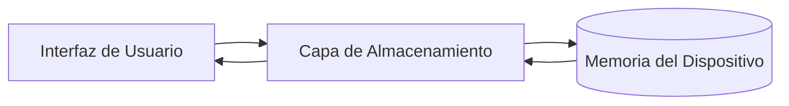

# Manage Your Money 💰

Una aplicación móvil moderna y sencilla para la gestión de capital personal, desarrollada con **React Native** y **Expo**.

> [!NOTE]
> This is the Spanish version. For the English version, click here: [README_en.md](./README_en.md)

## 🚀 Descripción del Proyecto

**Manage Your Money** te permite llevar un control detallado de tus finanzas mensuales. Registra tus ingresos y gastos de manera intuitiva, visualiza tu balance actual y recibe recordatorios para mantener tus cuentas al día.

## ✨ Características Principales

- **Dashboard Informativo:** Visualiza rápidamente tu balance total, ingresos y gastos del mes.
- **Gestión de Ingresos:** Registra múltiples fuentes de ingresos con descripciones y fechas.
- **Control de Gastos:** Clasifica tus consumos (servicios, rentas, compras) para saber a dónde va tu dinero.
- **Notificaciones Locales:** Recibe alertas y recordatorios configurables.
- **Almacenamiento Local:** Todos tus datos se guardan de forma segura en tu dispositivo (offline-first).
- **Animaciones Suaves:** Interacciones fluidas y feedback visual premium.

## 🛠️ Stack Tecnológico

- **Framework:** [Expo](https://expo.dev/) / [React Native](https://reactnative.dev/)
- **Navegación:** [React Navigation](https://reactnavigation.org/) (Bottom Tabs)
- **Persistencia de Datos:** [AsyncStorage](https://react-native-async-storage.github.io/async-storage/)
- **Estilos:** Flexbox & StyleSheet
- **Iconos:** Expo Vector Icons (Ionicons, MaterialCommunityIcons)

## 📁 Estructura del Proyecto

```text
/
├── assets/             # Recursos estáticos (iconos, splash)
├── documentation/      # Guías de arquitectura y diseño
├── navigation/         # Configuración de rutas y Bottom Tabs
├── src/
│   ├── screens/        # Vistas principales (Dashboard, Income, Expenses)
│   ├── storage/        # Lógica de persistencia de datos
│   ├── notifications/  # Configuración de notificaciones locales
│   └── types/          # Definiciones de TypeScript
└── App.tsx             # Punto de entrada de la aplicación
```

## ⚙️ Instalación y Ejecución

Para ejecutar este proyecto en tu entorno local, sigue estos pasos:

1. **Clonar el repositorio:**
   ```bash
   git clone <url-del-repositorio>
   cd manage-your-money-app
   ```

2. **Instalar dependencias:**
   ```bash
   npm install
   ```

3. **Iniciar el servidor de desarrollo:**
   ```bash
   npx expo start
   ```

4. **Abrir en tu dispositivo:**
   - Escanea el código QR con la app **Expo Go** (Android/iOS).
   - O presiona `a` para Android o `i` para iOS si tienes simuladores instaladores.

## 📊 Arquitectura de Datos

La aplicación utiliza un flujo unidireccional para la persistencia de datos:

