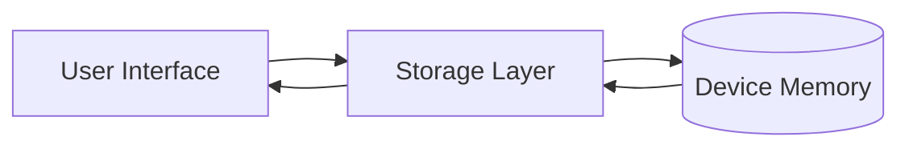

# Manage Your Money 💰

A modern and simple mobile application for personal capital management, built with **React Native** and **Expo**.

> [!NOTE]
> Esta es la versión en Inglés. Para la versión en Español, haz clic aquí: [README.md](./README.md)

## 🚀 Project Overview

**Manage Your Money** allows you to keep detailed track of your monthly finances. Log your income and expenses intuitively, visualize your current balance, and receive reminders to keep your accounts up to date.

## ✨ Key Features

- **Informative Dashboard:** Quickly view your total balance, monthly income, and expenses.
- **Income Management:** Register multiple income sources with descriptions and dates.
- **Expense Control:** Categorize your spending (utilities, rent, shopping) to know where your money goes.
- **Local Notifications:** Receive configurable alerts and reminders.
- **Local Storage:** All your data is securely saved on your device (offline-first).
- **Smooth Animations:** Fluid interactions and premium visual feedback.

## 🛠️ Technology Stack

- **Framework:** [Expo](https://expo.dev/) / [React Native](https://reactnative.dev/)
- **Navigation:** [React Navigation](https://reactnavigation.org/) (Bottom Tabs)
- **Data Persistence:** [AsyncStorage](https://react-native-async-storage.github.io/async-storage/)
- **Styling:** Flexbox & StyleSheet
- **Icons:** Expo Vector Icons (Ionicons, MaterialCommunityIcons)

## 📁 Project Structure

```text
/
├── assets/             # Static assets (icons, splash)
├── documentation/      # Architecture and design guides
├── navigation/         # Route configuration and Bottom Tabs
├── src/
│   ├── screens/        # Main views (Dashboard, Income, Expenses)
│   ├── storage/        # Data persistence logic
│   ├── notifications/  # Local notifications setup
│   └── types/          # TypeScript definitions
└── App.tsx             # Application entry point
```

## ⚙️ Installation and Setup

To run this project in your local environment, follow these steps:

1. **Clone the repository:**
   ```bash
   git clone <repository-url>
   cd manage-your-money-app
   ```

2. **Install dependencies:**
   ```bash
   npm install
   ```

3. **Start the development server:**
   ```bash
   npx expo start
   ```

4. **Open on your device:**
   - Scan the QR code with the **Expo Go** app (Android/iOS).
   - Or press `a` for Android or `i` for iOS if you have simulators installed.

## 📊 Data Architecture

The application uses a unidirectional flow for data persistence:

