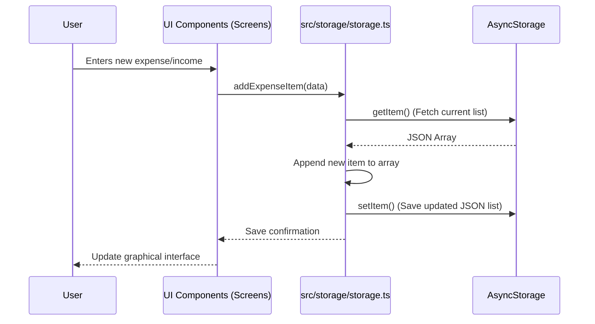
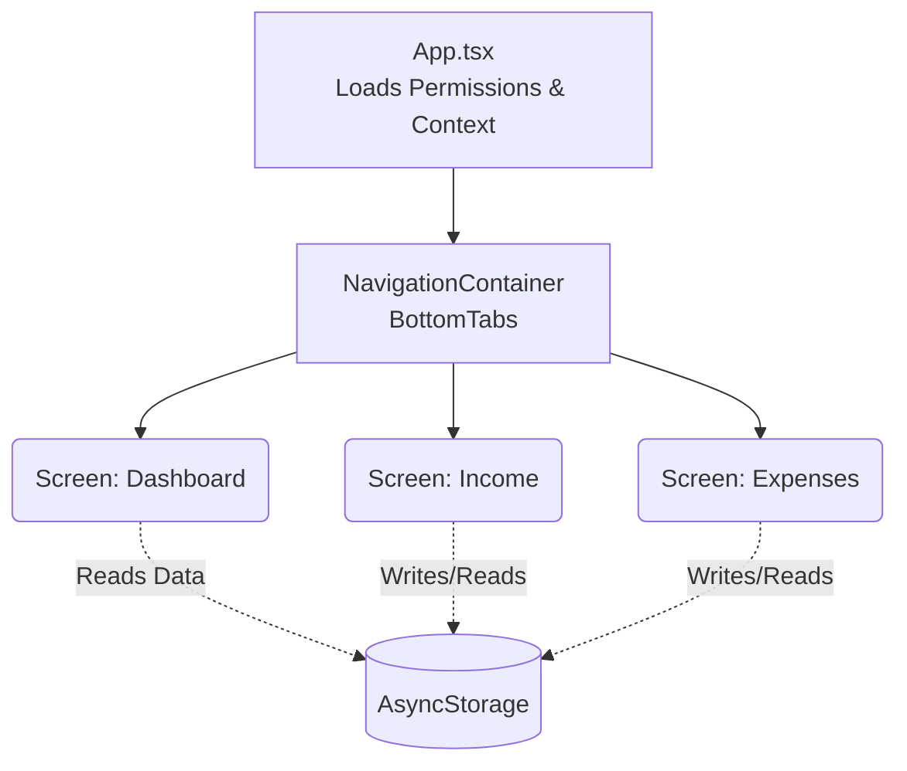

# Application Architecture (Manage Your Money)

This document describes the architecture and data flow of the "Manage Your Money" app, built with React Native and Expo.

## Core Technologies
- **Framework:** React Native with Expo
- **Navigation:** React Navigation (Bottom Tabs)
- **Local Storage:** AsyncStorage
- **Notifications:** Expo Notifications
- **Styling and UI:** React Native StyleSheet, Expo Vector Icons

---

## Project Structure

The app follows a modular structure for easier maintenance:

- `App.tsx`: The main entry point. Initializes essential providers such as `NavigationContainer` and `SafeAreaProvider`, and handles the bootstrapping of global services (e.g., requesting notification permissions).
- `navigation/`: Contains the app's navigators, primarily `BottomTabs.tsx` which manages the bottom tab bar and the main screens.
- `src/screens/`: Contains the primary views (Dashboard, Income, Expenses).
- `src/storage/`: Handles all data persistence (CRUD operations) by communicating with `AsyncStorage`.
- `src/notifications/`: Centralizes the logic for scheduling and canceling local notifications.
- `src/types/`: TypeScript definitions for robust typing (e.g., `IncomeSource`, `ExpenseItem`).

---

## Data Storage Flow

The application uses `@react-native-async-storage/async-storage` as the local on-device database, storing information persistently in JSON format.

### Interaction Flow (Mermaid)

### State Management
Currently, screens fetch data directly from `storage.ts` using React hooks like `useEffect` and manage their own local state using `useState`. For more complex architectural needs, this could scale towards global contexts (React Context) or state managers like Zustand/Redux.

---

## Screen Flow and Navigation

