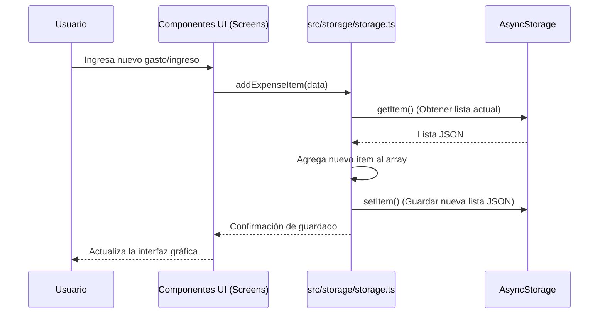
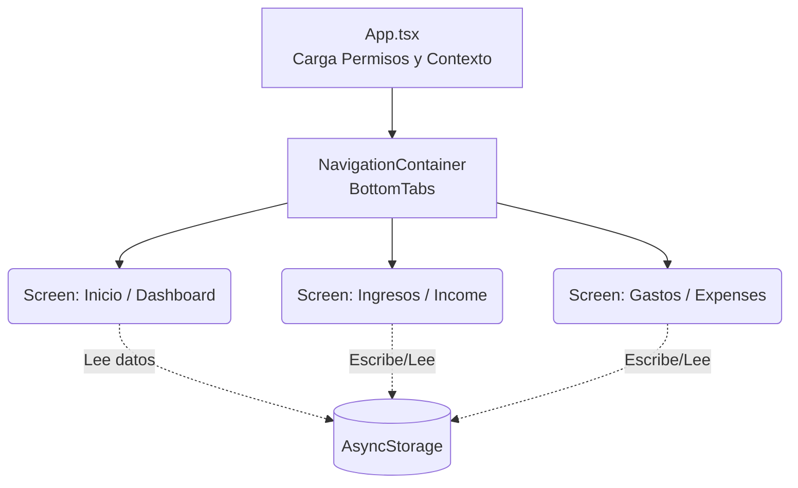

# Arquitectura de la Aplicación (Manage Your Money)

Este documento describe la arquitectura y el flujo de datos de la aplicación "Manage Your Money", desarrollada con React Native y Expo.

## Tecnologías Principales
- **Framework:** React Native con Expo
- **Navegación:** React Navigation (Bottom Tabs)
- **Almacenamiento Local:** AsyncStorage
- **Notificaciones:** Expo Notifications
- **Estilos y Componentes:** React Native StyleSheet, React Context (opcional), Expo Vector Icons

---

## Estructura del Proyecto

La aplicación sigue una estructura modular para facilitar el mantenimiento:

- `App.tsx`: El punto de entrada principal. Inicializa proveedores esenciales como `NavigationContainer` y `SafeAreaProvider`, y gestiona el arranque de servicios globales (ej., permisos de notificaciones).
- `navigation/`: Contiene los navegadores de la app, principalmente `BottomTabs.tsx` que maneja el menú inferior y las pantallas principales de la aplicación.
- `src/screens/`: Contiene las vistas principales (Dashboard, Ingresos, Gastos).
- `src/storage/`: Maneja toda la persistencia de datos (CRUD) comunicarse con `AsyncStorage`.
- `src/notifications/`: Centraliza la lógica de programación y cancelación de notificaciones locales.
- `src/types/`: Definiciones de TypeScript para una tipificación robusta (ej. `IncomeSource`, `ExpenseItem`).

---

## Almacenamiento de Datos (Storage Flow)

La aplicación utiliza `@react-native-async-storage/async-storage` como base de datos local del dispositivo, almacenando la información en formato JSON.

### Flujo de interacciones (Mermaid)

### Gestión de Estado
Actualmente, las pantallas cargan los datos directamente de `storage.ts` utilizando hooks como `useEffect` y manejan su propio estado local con `useState`. En arquitecturas más complejas, esto podría escalar hacia contextos globales (React Context) o manejadores de estado como Zustand/Redux.

---

## Flujo de Pantallas y Navegación

